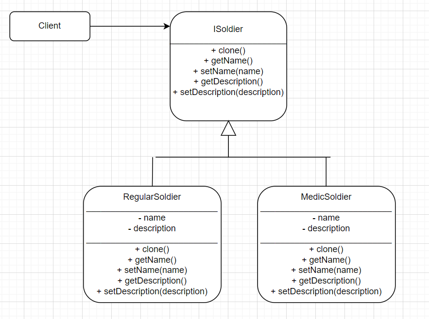
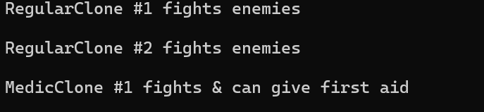

### Prototype Pattern to Create Clone Troopers
We are all familiar with the iconic storm troopers from the Star Wars franchise, and I will be creating my very own clones with the help of the Prototype Pattern. Prototype is a creational design pattern that allows us to create new objects by copying an existing object. I decided to have two types of clones, a regular soldier who only fights, and a medic soldier who fights and has first aid skills.

Some examples of protoype pattern I saw use a distinct client element, which interacts with the Prototype interface to create objects, but since my program is very simple, I added client's functionality to the Main() function.
Here is a diagram:

Sample output:

